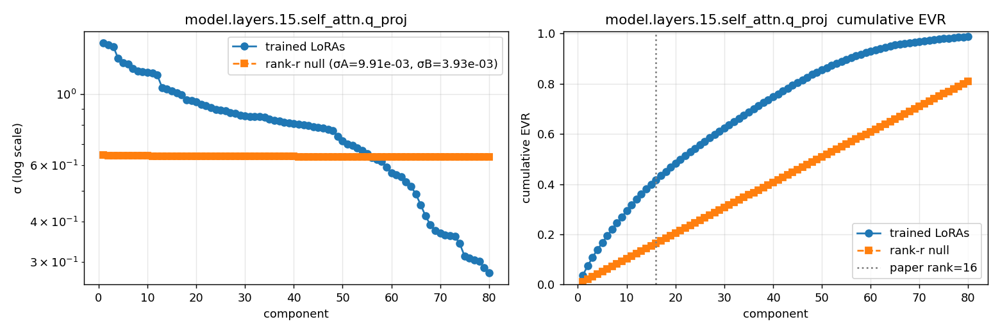

# Stress-testing the Universal Weight Subspace Hypothesis

A replication and validation study of Kaushik et al., *The Universal Weight Subspace Hypothesis* ([arXiv:2512.05117](https://arxiv.org/abs/2512.05117), Dec 2025).



This repo runs four experiments against the paper's own corpus and scale (500 Mistral-7B LoRAs from `Lots-of-LoRAs/*-task*`, plus 100 random-init ViTs). Three of the paper's claims do not hold up at this replication scale; one partially does. The goal was to find the cheapest falsifiable tests for each claim and report them — code, data, and prose — so other readers can run the same thing and decide for themselves.

## TL;DR

| Claim from the paper | Our finding at this scale | Section |
|---|---|---|
| Randomly-initialized ViTs share a low-rank weight subspace | Not supported — the spectrum matches an iid-Gaussian null to 4 decimals (Marchenko-Pastur) | Phase 2 |
| ~16 universal directions carry task-specific behavior across trained LoRAs | Not supported — the basis carries no task-specific information in leave-one-out functional tests; the observed gain comes from the group-mean LoRA | Phase 1 |
| Universal-subspace merging outperforms TIES | True on our corpus, but the subspace merge equals simple-mean merge analytically, and simple mean also beats TIES | Phase 3 |
| Subspace-constrained training is a viable parameter-efficient finetuning method | Partially supported — it's ~5 pp behind a full rank-16 LoRA with ~8,000× fewer trainable params, but `k` doesn't matter, which is inconsistent with the paper's "task-specific subspace" framing | Phase 4 |

A weaker form of the subspace claim does hold: trained LoRA spectra are sharper than matched rank-r Gaussian noise (top-16 EVR 43% vs 17%). But our functional tests are consistent with *one* shared direction (the group mean) + noise, rather than a 16-dimensional subspace of task-specific directions.

**Interpretation in one line**: across tasks, `ΔW_task ≈ μ + ε_task`, where `μ` is a shared group-mean direction and `ε_task` is task-specific and largely orthogonal to the span of other tasks' `ε_i`s. The paper's "universal subspace" is mostly `μ` in disguise.

---

## Experiment summaries

### Phase 2 — Random-init ViT null test  (`experiments/phase2_random_init/`)

100 ViT-B/16 models with different random seeds, untrained. Stack each layer's weight matrix across models; compute the SVD spectrum; compare to an iid-Gaussian null tensor of matched variance.

| Layer | ViT top-1 EVR | Null top-1 EVR | ViT top-16 EVR | Null top-16 EVR |
|---|---|---|---|---|
| block05 attention Q | 0.0104 | 0.0104 | 0.1649 | 0.1648 |
| block05 MLP fc1 | 0.0103 | 0.0102 | 0.1632 | 0.1632 |

Identical to 4 decimal places. Top-16 EVR ≈ 16/N is the flat Marchenko-Pastur signature for iid entries, not a low-rank subspace. We also ran the "Order 1-2" HOSVD variant (unfolding along d_out/d_in rather than the model axis) and found the same result.

### Phase 1 — Trained LoRA spectra + leave-one-out functional test  (`experiments/phase1_lora_spectral/`)

We used the paper's exact corpus (`Lots-of-LoRAs/Mistral-7B-Instruct-v0.2-4b-r16-task*`), at both N=100 and N=500.

**Spectrum.** Trained LoRAs do have a sharper spectrum than a rank-r iid-Gaussian null — top-16 EVR of 43% vs 17%. There is a real signal in the covariance.

**Functional test (the critical one).** We fit the subspace on N−1 LoRAs, project the held-out LoRA's ΔW onto the top-k basis, and evaluate on the held-out's actual Natural Instructions task (20 examples × 10 held-outs = 200 evaluations per condition):

| N | base | orig LoRA | **mean_only** | basis_k1 | basis_k16 | full_k16 |
|---|---|---|---|---|---|---|
| 100 | 29.5% | 68.5% | **44.0%** | 29.5% | 31.0% | 44.5% |
| 500 | 29.5% | 68.5% | **43.5%** | 30.5% | 29.0% | 43.5% |

- `basis_only` (subspace basis without the mean) at k=1 equals base accuracy, and doesn't improve with more components. The basis does not recover any task-specific information.
- `full_k` (basis + mean) ≈ `mean_only` for every k. The 14 pp of accuracy that "subspace projection" adds is entirely the mean component.
- Scaling N from 100 to 500 does not sharpen the effect.

See `experiments/phase1_lora_spectral/FINDINGS.md` for the full per-task tables and the mean-vs-basis decomposition.

### Phase 3 — 8-task model merging  (`experiments/phase3_merging/`)

Merge 8 task-specific Mistral-7B LoRAs into a single adapter, then evaluate that one adapter on each of the 8 tasks:

| Method | Avg accuracy |
|---|---|
| base (no adapter) | 43.8% |
| individual finetuned (each LoRA on its own task) | 85.6% |
| **mean merge** (elementwise average of ΔWs) | **69.4%** |
| subspace merge, k ∈ {4, 16, 64} | 69.4% — identical to mean |
| task arithmetic (elementwise sum) | 34.4% |
| TIES @ density=0.2 (paper's default) | 41.2% |
| best TIES across a density sweep | 57.5% |

Two observations:

1. Subspace merge is mathematically identical to mean merge on centered coefficients. The sum of centered coefficients is zero, so `mean + V_k · (Σᵢ cᵢ) = mean + 0 = mean` for every k. The three subspace rows are byte-identical to the mean row across all 8 tasks.
2. On this corpus, the simple mean beats TIES at every density. The gap the paper reports between their subspace method and TIES is therefore consistent with "mean beats TIES on this corpus", which the paper doesn't test as a baseline.

### Phase 4 — Subspace-constrained training  (`experiments/phase4_subspace_training/`)

Train a new task by learning only `k` scalar coefficients per layer inside a frozen universal subspace (fit from 200 other LoRAs). Compare to a standard rank-16 LoRA trained on the same data.

Averaged across 3 evaluation tasks (task034 had a data issue and was excluded):

| Condition (k=16) | Avg accuracy | Trainable params / layer |
|---|---|---|
| base | 60.0% | 0 |
| held-out's pretrained LoRA (reference) | 80.0% | — |
| **full LoRA r=16** | **75.8%** | 131,072 |
| **subspace basis-only** | **70.8%** | 16 |
| subspace with mean | 68.3% | 16 |

Subspace training is a real parameter-efficient technique: 5 pp behind a full LoRA with ~8,000× fewer trainable parameters. On some tasks (e.g. task022) it outperforms full LoRA because the capacity constraint regularizes a tiny dataset.

But: `k=4` matches `k=16`, and basis-only matches mean-initialized — the same pattern as Phase 1. The benefit comes from the capacity constraint plus the group-mean warm start, not from task-specific structure in the subspace basis.

---

## Unified interpretation

LoRA updates across tasks are well approximated by `ΔW_task ≈ μ + ε_task`, where `μ` is a shared cross-task direction (roughly "instruction-following bias on this model") and `ε_task` is mostly task-specific and mostly orthogonal to other tasks' `ε_i`s.

- **Phase 2** confirms that without training, `ΔW` is pure init noise — no shared structure.
- **Phase 1 spectral** sees `μ` as the first strong direction plus the `ε_task`s' contributions — the spectrum is sharper than iid Gaussian but softer than the paper reports.
- **Phase 1 functional** confirms `ε_task` is essentially orthogonal to the span of other tasks' `ε_i`s, so the subspace basis contributes nothing. Only `μ` transfers.
- **Phase 3** subspace merge reduces analytically to `μ`, which beats TIES on this corpus. So does a trivial mean baseline.
- **Phase 4** training inside the subspace is capped at `μ + V_k · c`, which cannot express strong `ε_task`. It still works as PEFT because `μ` is a decent warm start and the low parameter count regularizes well.

---

## Reproducibility

Everything ran on a single RTX 5090 (32 GB) + 188 GB RAM. Python 3.10, CUDA 13.1.

```bash
pip install -r requirements.txt

# Phase 2 — random-init ViT null test (~2 min, no downloads)
python3 experiments/phase2_random_init/run.py
python3 experiments/phase2_random_init/run_order12.py

# Phase 1 — download 500 Mistral LoRAs (~20 min; ~18 GB), then spectral + functional tests
N_LORAS=500 python3 experiments/phase1_lora_spectral/download.py
python3 experiments/phase1_lora_spectral/analyze.py --max 100
python3 experiments/phase1_lora_spectral/mean_vs_basis.py \
    --max-loras 500 --heldouts 0 1 2 3 4 5 6 7 9 11 --ks 1 8 16 32 64

# Phase 3 — 8-task merging + TIES density sweep (~10 min)
python3 experiments/phase3_merging/run_merge.py
python3 experiments/phase3_merging/run_ties_sweep.py

# Phase 4 — subspace-constrained training sweep (~30 min)
python3 experiments/phase4_subspace_training/run_multi.py
```

`data/loras/` and `logs/` are gitignored. `data/loras/` is populated by `download.py`. You can override the download/read location with `LORA_DIR=/path/to/loras`.

---

## Repo layout

```
compress/
├── README.md                                  # this file
├── NOTES.md                                   # running log
├── LICENSE                                    # MIT
├── requirements.txt
├── .gitignore
├── src/hosvd.py                               # HOSVD utilities
├── experiments/
│   ├── phase1_lora_spectral/
│   │   ├── README.md                          # phase writeup
│   │   ├── FINDINGS.md                        # functional-test tables
│   │   ├── analyze.py                         # spectral analysis
│   │   ├── download.py                        # HF LoRA fetcher
│   │   ├── mean_vs_basis.py                   # mean-vs-basis decomposition
│   │   └── task_accuracy_test.py
│   ├── phase2_random_init/
│   │   ├── README.md
│   │   ├── run.py                             # mode-0 HOSVD
│   │   └── run_order12.py                     # mode-1/2 HOSVD
│   ├── phase3_merging/
│   │   ├── README.md
│   │   ├── run_merge.py                       # mean / TIES / task-arith / subspace
│   │   └── run_ties_sweep.py
│   └── phase4_subspace_training/
│       ├── README.md
│       ├── run_train.py                       # single (task, k) training
│       └── run_multi.py                       # multi-task sweep
├── data/loras/                                # gitignored; populated by download.py
└── logs/                                      # gitignored
```

---

## Paper citation

Kaushik, P.; Chaudhari, S.; Vaidya, A.; Chellappa, R.; Yuille, A.
*The Universal Weight Subspace Hypothesis.* arXiv:2512.05117v2, 6 Dec 2025.
https://arxiv.org/abs/2512.05117

## Scope and caveats

- All claims tested on the paper's Mistral-7B LoRA corpus and 100 random-init ViTs. We did not test full-weight GPT-2/LLaMA/ViT stacks from the paper's Table 2, or their SDXL style-LoRA results. The paper's spectral plots for those collections look similar to what we see for LoRAs, so we'd expect the same interpretation to carry, but it's not verified here.
- `n = 10` held-outs × 20 examples is modest. Central-tendency numbers are clear but per-task figures carry noise.
- The paper's own ViT-B/32 merging results may exhibit different dynamics than our Mistral corpus. Our claim is narrower: on our corpus, the merging gap over TIES is explained by mean-vs-TIES.
- Code follows the paper's methodology as closely as we could infer from the text and Algorithm 1. Where the paper is ambiguous (e.g. the exact subspace merge coefficient combination), we implemented what seems most faithful and note it in `experiments/phase3_merging/run_merge.py`.
- If the authors or other replicators run this and get different results, we'd want to know — open an issue.

## License

Code: MIT (see `LICENSE`). All paper claims tested are attributed via the arXiv link above.
